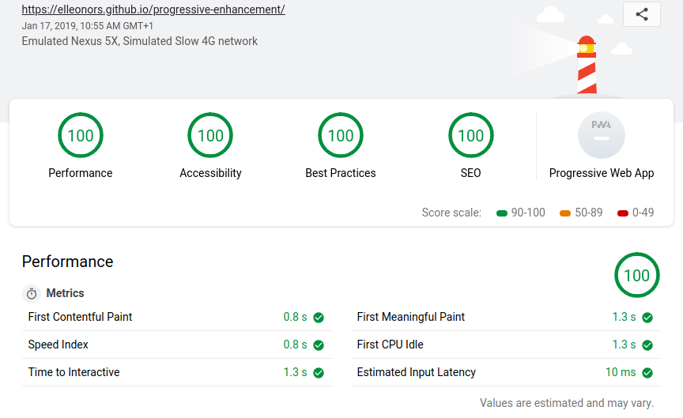
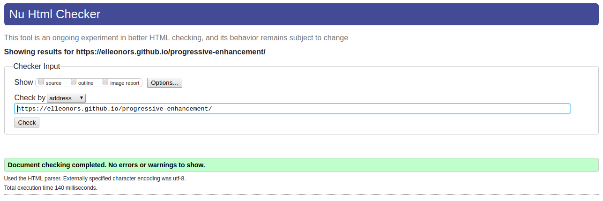

# Progressive-Enhancement

Voilà le thème du document que l'on s'est vu proposer adapter en page html.

Voici ci-dessous le site proposé :  
https://elleonors.github.io/progressive-enhancement/

C'est un projet en solo, sur une durée de quelques heures.

## techniques
Les techs utilisées ici sont simples : html et css.
C'est une façon pour nous de faire le plus possible à partir de rien , d'une feuille blanche.
Il s'agit de notre deuxième projet , et de notre premier mois de code.
nous pouvons observer des structures de base : des tables, des listes , des objets différents.

## validations
voici nos validation en lighthous et W3C :

       Merci beaucoup !